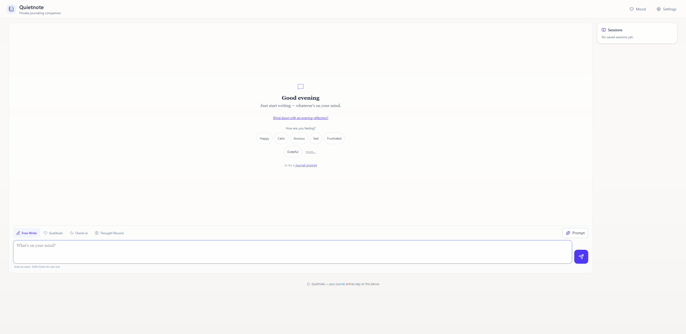
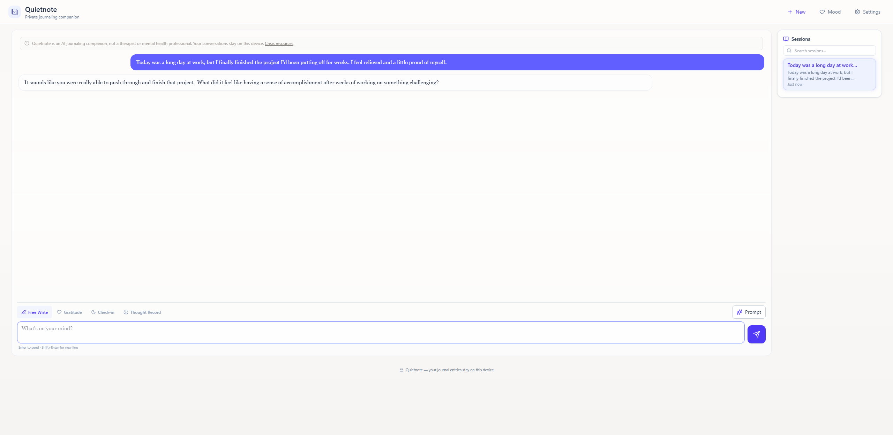

# QuietNote

**QuietNote** is a private AI journal that runs entirely in your browser. The language model downloads to your device and every word you write stays in local browser storage — nothing you type is ever sent to a server. It's open source so you don't have to take that claim on faith.

**Live app:** [https://guzzler.github.io/QuietNote/](https://guzzler.github.io/QuietNote/) — runs in Chrome or Edge; the first visit downloads the model (~2.0 GB) once.



## How privacy actually works here

- **All AI inference happens in your browser.** The model runs on your own hardware via WebGPU — there is no API, no backend, no account.
- **Your journal lives in your browser's local storage (IndexedDB) only.** Entries, moods, and sessions never leave your device. You can export or erase everything from the privacy dashboard at any time.
- **The only network traffic is the one-time model download** from public model CDNs (Hugging Face / WebLLM). After that, journaling works offline.
- **No telemetry, no analytics, no tracking.** None.
- **The code is open source**, so you can verify every one of these claims yourself instead of trusting a privacy policy.

## Four ways to write

- **Free Write** — start typing whatever's on your mind; the companion reflects and asks gentle follow-ups.
- **Gratitude** — capture what you're thankful for and sit with it a little longer.
- **Check-in** — a short guided pulse on how you're doing right now.
- **Thought Record** — walk a difficult thought through a structured CBT-style reframe.



## An honest note on what this is

QuietNote is an **AI journaling companion — not therapy, not a therapist, and not crisis support**. It's built with guardrails (crisis detection, response limits, a persistent disclaimer), but it is software, not care. If you're in crisis, please reach out to a professional or a crisis line; the app will point you to resources, and means it.

If you're one of the first testers, start with [the welcome note](docs/beta/WELCOME.md).

## What you need to run it

- **A WebGPU-capable browser**: recent Chrome or Edge on desktop are the reliable choices today. Firefox and Safari support is still uneven; unsupported browsers get an honest message rather than a broken app.
- **A one-time model download**: the default model (Gemma 4 E2B via MediaPipe) is about **2.0 GB**, downloaded once and cached by your browser. Two alternative engines are available under Settings → Privacy & your data → Inference Engine: Gemma 2 2B via WebLLM (**~1.5 GB**) and Gemma 4 E2B via Transformers.js (**~3.2 GB**).
- **A reasonably capable device**: local inference is real work; a laptop or desktop with a decent GPU gives the best experience. Mobile is not the target right now.
- Sessions persist across reloads — close the tab, come back, pick up where you left off.

---

## Development

React 19 + TypeScript (strict) + Vite, Tailwind CSS 4, Framer Motion. Inference backends: [WebLLM](https://github.com/mlc-ai/web-llm) (WebGPU), [Transformers.js](https://github.com/huggingface/transformers.js) (ONNX), and [MediaPipe LLM Inference](https://ai.google.dev/edge/mediapipe/solutions/genai/llm_inference) (LiteRT). Storage is IndexedDB via the browser — there is no server component at all.

```bash
npm install
npm run dev      # dev server at http://127.0.0.1:5173/QuietNote/
npm run test     # 1300+ Vitest tests
npm run build    # production build (TypeScript strict)
npm run lint
npx vite preview # serve the production build locally
```

The safety-relevant modules (`src/prompts/`, `src/utils/crisisDetection.ts`, `src/utils/responseGuardrails.ts`, `src/utils/responseShaping.ts`, `src/utils/referralReprompt.ts`) are load-bearing and gate releases; changes there run a full eval read before merging.

---

## License

[MIT](LICENSE) — © 2026 Sharang Pai.

The models QuietNote downloads at runtime carry their own separate terms (the Gemma models are covered by Google's Gemma Terms of Use); this license covers the application code only.
